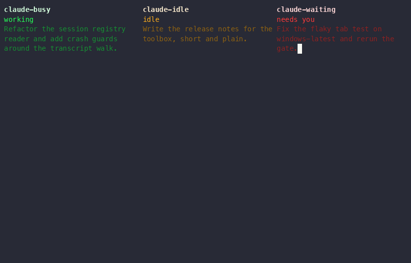

# How the rain works



`matrix.ps1` runs in the alternate screen buffer: scrollback survives, `q`
exits. The glyphs are half-width katakana. They render one cell wide, so the
grid stays square.

It runs on Windows and on Linux. Each platform brings its own console layer and
its own terminal backend: the Windows console API with Windows Terminal, or
termios with Konsole or tmux. The rain above them is the same code.

`Get-Help .\matrix.ps1 -Full` lists every flag. `Invoke-Pester ./tests` runs
the test suite (Pester 5 or later). CI runs it on both platforms, because a
green Windows job says nothing about code that only Linux executes.

## The Windows Terminal profile

`install-terminal-profile.ps1` adds one profile that opens the session view:

```
-Fps 60 -Stats -ThisWindow -Click
```

Windows Terminal reloads `settings.json` on save, so the profile appears in the
dropdown at once. The profile GUID derives from `-Name`: a re-run updates the
same profile, `-Remove` deletes it, `-Arguments` changes what it runs.

The CRT effect is off; `-Retro` turns it on. A re-run rewrites only what the
script owns (name, command line, icon). Everything else on the profile carries
over - colour scheme, font, opacity, the CRT effect - and the profile keeps its
place in the dropdown.

The first run copies `settings.json` to `settings.json.matrix-bak` and never
overwrites that backup. The rewrite drops comments and hand formatting; the
backup keeps them.

**Open the profile as a tab, not as a window.** `-ThisWindow` scopes the lanes
to the window the rain starts in, and a fresh window holds no Claude sessions.

## Session status

The screen splits into one vertical lane per open session. Every
lane rains the same katakana. Colour, fall rate, and a fixed header tell them
apart:

```
matrix-session-status       <- name, or folder · branch
working 6m                  <- status, and how long it has held it
Let's copy in the           <- the opening prompt, wrapped
matrix.ps1 script from D:
root. I want us to make i…
```

The name is whatever `/rename` set. A name Claude Code made up itself
(`nameSource` of `derived` or `collision`) is replaced by the folder and
branch, which say more.

A narrow lane drops rows instead of wrapping them into stubs: under 18 columns
the task goes, under 10 the name goes too.

Colour and fall rate track the status. Tune them per status in `styles.psd1`;
`.\preview-matrix.ps1` shows one lane per state to check the result
(`-Shuffle` flips states at random, to watch transitions):

| Registry `status` | Lane | Rate |
| --- | --- | --- |
| `busy` | green | fast |
| `idle` | amber, turn ended and the prompt is showing | slow |
| `waiting` | red, blocked on an answer; `waitingFor` names it | crawling |

Status comes from `~/.claude/sessions/<pid>.json`, the peer-discovery registry
every session writes - the same source `ListAgents` reads. The CLI rewrites its
record the moment a session changes state.

### A host that writes no status

The VS Code extension registers a session once, at startup, and never returns:
no `status` for the whole of its life. Read literally that is an idle session,
so every such lane sat amber whatever it was doing.

The transcript is the second witness. `~/.claude/projects/*/<sessionId>.jsonl`
is appended in real time by every host, and its newest *conversation* record -
`assistant` or `user`, walking back past the bookkeeping records most files end
on - says whether the turn is over:

| Newest conversation record | Lane |
| --- | --- |
| `assistant`, not stopped on a tool | `idle` |
| `assistant` stopped on `tool_use`, or `user` | `busy` |
| either of those, but the file has not grown for 90 s | `waiting` |

The last row is the one guess: a permission prompt is written to no file, so a
long silence mid-turn is the only sign of one, and a slow build goes red too.
Red early is a nuisance, green forever is the bug. `BlockedSeconds` in
`lib/sessions.ps1` is the threshold.

A registry that does write a status is always believed - it knows the
`waitingFor` reason a file cannot. The transcript is read only when the
registry says nothing, and a lane it cannot answer for keeps the registry's
answer. No transcript at all is a session that has never taken a turn, and gets
no lane: that is the empty session a VS Code window opens with, left registered
and alive when you open a past session in its place. The lane appears when the
session is used.

The header ages a status from the write that changed it, not the newest one.

The registry also names a per-session pipe, `\\.\pipe\LOCAL\cc-msg-<hash>`,
which carries the peer message protocol and its `notify_idle` subscription.
**A script cannot subscribe to it.** The receiver vets the reply address
against `verifiedPeerPid` and drops a frame whose requester has no bound inbox.
Nothing here touches the pipe.

Liveness is a PID check plus the recorded `procStart` FILETIME. The FILETIME
stops a recycled PID from resurrecting a dead session.

## Keys

`q` exits, upper or lower case. Ctrl+C exits too, because the rain runs stdin
raw and there is no SIGINT to catch.

The rain reads every other key and discards it. The reader in `lib/cs/ConsoleVT_*.cs`
answers one of four verdicts: `NONE`, `EXIT` for Ctrl+C, `CLICK` with the cell,
and `KEY` with the character. The reader never decides what a letter does. The
one binding lives in the frame loop in `matrix.ps1`, so a second binding is a
line in one place.

A chord is not a key. Ctrl and Alt combinations, bare modifiers, function keys
and the arrow and page keys the wheel sends all read as `NONE`. Alt+q does not
quit a rain that quits on `q`, and scrolling back through the history does not
end it.

## This window only, and clicking a lane

```powershell
.\matrix.ps1 -ThisWindow -Click
```

`-ThisWindow` keeps only the sessions in the same terminal window as the rain.
`-Click` makes a left click on a lane switch to that session's tab. Both rest on
the same tab map. On Windows the backend is Windows Terminal over UI Automation:

| Step | How |
| --- | --- |
| Find the windows | `EnumWindows` for visible `CASCADIA_HOSTING_WINDOW_CLASS` handles |
| Find our window | the terminal in front when the rain starts |
| Find each window's tabs | UI Automation, `TabItem` descendants of that window handle |
| Read the click | `ENABLE_MOUSE_INPUT` on, QuickEdit off, then decode `MOUSE_EVENT` records |
| Switch the tab | every WT tab exposes `SelectionItemPattern`, so `Select()` raises it |
| Pick a session's tab | a guess, see below |

**Do not use the process tree on Windows Terminal.** It hosts every window in
one process, so `claude.exe <- pwsh.exe <- WindowsTerminal.exe` resolves to the
same PID for every session on the machine. Konsole is one process for every
window too, but it will name a tab's shell PID over D-Bus, which is what makes
the process tree the exact answer there and a dead end here.

Nothing identifies our own window exactly either. ConPTY leaves
`GetConsoleWindow` null, and UI Automation sees only the terminal's chrome, no
text. Naming our own tab and searching for it would be exact, but Windows
Terminal pins a hand-renamed tab and stops titling it. So the rain takes the
window in front at startup: one call, no side effects, correct whenever the
rain is started by typing in it. It is read before anything slow runs.

No API maps a console process to the tab hosting it, so a session's tab is
matched on its title. Claude Code writes that title itself: a status glyph,
then a summary of the turn.

| Glyph | Means |
| --- | --- |
| `U+25D0` `U+25D1` | working - two frames of a spinner, 960 ms apart |
| `U+2733` | not working |

The glyph is checked against the status we already have, and the rest of the
title against the session's opening prompt. The lane header names the matched
tab (`working 6m [tab 3]`), so a wrong match is visible. The number is what
Ctrl+Alt+N uses in that tab's own window; tabs are numbered per window.

`-ThisWindow` places a session in a window by its tab. A session with no
matched tab is dropped, not guessed to be ours.

QuickEdit is off while the rain runs, so that window cannot select text with
the mouse. It goes back on at exit.

Both flags need `showStatusInTerminalTab` on in Claude Code. Without it the
tabs carry no glyph and nothing matches.

### Konsole, on Linux

Konsole answers the same six questions over D-Bus, spoken straight to its Unix
socket. There is no client library and no helper binary.

| Step | How |
| --- | --- |
| Find the windows | `Introspect` on `/Windows` names one node per window |
| Find our window | `KONSOLE_DBUS_WINDOW`, set before the shell starts. Exact, not a guess |
| Find each window's tabs | `sessionList` on the window, then `processId` per session |
| Read the click | termios raw mode, SGR mouse reporting (modes 1000 and 1006) |
| Switch the tab | `setCurrentSession` on the window |
| Pick a session's tab | the tab whose process id is among the session's ancestors |

The last row is the difference that matters. Konsole names a tab's shell PID, so
the match is exact and none of the title scoring below applies. The walk goes up
from the claude PID, because claude is often not the tab shell's direct child.

Konsole cannot raise a window. `org.kde.konsole.Window` is ViewManager's whole
scriptable list and nothing in it raises or activates, so clicking a session that
lives in another Konsole window switches that window's tab where you cannot see
it. Windows Terminal has no such gap.

`showStatusInTerminalTab` is not needed here, since nothing reads the title.

Start the rain from the window you want scoped, and keep that window in front
while it starts. When `-ThisWindow` finds nothing it stops with an explanation;
a filter that silently does nothing reads as a bug.

### tmux, on Linux

tmux nests in every terminal, so it wins the backend question: a rain inside
tmux talks tmux, whether the outer terminal is Konsole, a plain xterm, or
another tmux - `$TMUX` names the innermost server, and the client reaches it on
its own. There is nothing to configure beyond that.

| Step | How |
| --- | --- |
| Find the windows | there are none; a tmux session is the scope, a window is the tab |
| Find our scope | `tmux display-message -p -t $TMUX_PANE '#{session_id}'` - exact, like `KONSOLE_DBUS_WINDOW` |
| Find every tab | one `tmux list-panes -a -F '…'`: session id, window id, window index, `pane_pid`, `pane_id` |
| Read the click | the same termios + SGR mouse path; tmux translates it both ways, coordinates pane-relative |
| Switch the tab | `tmux select-window -t @3` |
| Pick a session's tab | the pane whose `pane_pid` is among the session's ancestors - exact, no title scoring |

tmux parses every escape the rain writes - the alternate screen, the cursor, the
mouse modes - and re-encodes them for the outer terminal itself, so there is no
`allow-passthrough`, no DCS wrapper, and no tmux version floor beyond mouse
forwarding. It re-encodes mouse coordinates relative to the pane too, which is
what the grid wants: a rain in a split still lines its lanes up with its clicks.

**`set -g mouse on` in the outer tmux is required.** With it, a click's default
binding is `select-pane` followed by a pass-through, so the rain sees it. Without
it tmux never asks the outer terminal for mouse events and `-Click` silently
does nothing - tmux does not warn.

**Windows, not panes.** A click switches to the session's window; a pane
sharing the rain's own window is a no-op click, and the rain stays where it is
until `q` leaves it. A session in another tmux *session* has that
session's current window moved where nobody can see it - Konsole's "cannot
raise" gap, one level up; `switch-client` would fix it and is deliberately out
of scope.

A session running over ssh inside a pane never appears in the tab map: its pid is
not in this machine's `/proc`, so liveness drops it before the rain reads the map.
`-Remote` shows those sessions instead, by a route that does not involve this
machine's process tree at all. See "Sessions over ssh" below.

Start the rain from the tmux session you want scoped. Nothing has to be in front
while it starts - `$TMUX_PANE` names our pane and the server answers for it
exactly, so unlike Windows Terminal there is no launch-time race to lose. When
`-ThisWindow` finds nothing it stops with an explanation; a filter that silently
does nothing reads as a bug.

### A match that has not caught up

A tab read costs ~100 ms (three frames), so it runs only when a session
appears, goes, or changes status. The tab always lags the registry: Claude
titles a new tab, and moves its glyph, after the registry already carries the
change. A rebuild in that gap matches nothing, so a miss is never the last
word:

- **A miss is re-tried**: at 2 s first, backing off to 30 s while the same
  sessions keep missing, until every session has a tab.
- **A session keeps its last tab** when a rebuild cannot re-match it. The old
  tab is the best evidence until a better one arrives. A fresh match always
  wins, and a tab this pass gave to someone else is never carried.

The rain's own tab needs no exclusion: the rain writes no tab title, so its
tab carries no glyph and is never a candidate.

`tests/TabMap.Tests.ps1` replays all of it: a session appearing, a session
prompted, the tabs renumbered, and the desktop refusing to be read.

## Sessions over ssh

One rain on the machine you sit at, showing every machine you ssh to.

Add one line per machine to `~/.ssh/config`, once:

```
Host lab1 lab2 lab3
    RemoteForward 127.0.0.1:47777 127.0.0.1:47777
```

Then, in a tmux window on the machine you logged in to:

```powershell
./matrix.ps1 -ExposeOnSSH
```

On the machine in front of you:

```powershell
./matrix.ps1 -Remote -Click
```

A remote lane is named `lab1: <session>`. The machine leads because the header's
name row is one clipped line, so a trailing machine name is the first thing a
narrow lane loses. It is a colon, not the middle dot a derived name already uses:
`lab1 · api · main` reads as three parts. `lab1: api · main` reads as one machine
and one session. Under 10 columns the name row goes, for every lane alike.

### The route

The reporting side connects to its own `127.0.0.1:47777`. sshd is already
listening there because of the `RemoteForward`, and it hands the channel to the
ssh client on your machine, which connects to the rain. So neither end runs ssh
itself, and no second connection is opened. The forward rides the login you
already typed, which is why nothing here assumes a key.

Every machine dials the same port, and the rain tells them apart by the first
line each one sends. One listener, however many machines.

The payload is one JSON object per line.

The rain answers the first line: a welcome, or the reason it refused. That answer
is the only thing that tells the reporting side a rain is there. sshd accepts its
connection whether or not one is, and drops the channel a moment later when the
ssh client on your machine finds nothing to connect to. Run the report with
`-Stats` and its line leads with where it stands:

| It reads | It means |
| --- | --- |
| `host waiting` | Nothing takes the connection. No ssh session carries the forward, or it is on another port |
| `host connecting` | Something takes it and no rain has answered. A host running no rain holds here: sshd accepts, the far end drops the channel a moment later, and the report redials |
| `host connected` | The rain welcomed this machine |
| `host refused: wrong token` | The rain said no, and why. It outlasts the redial that follows, so the word that names the fix stays on screen, and expires a few retries after the rain stops saying it - retries, not seconds, because a slow `-PollSeconds` is a slow redial |

A remote session never enters the tab map, because it has no pid on this machine.
A remote pid that happened to exist here would claim a local tab and block the
session that owns it. `-ThisWindow` does not drop remote lanes either. Asking for
another machine's sessions and then filtering them by window would read as a
broken flag.

### Clicking a remote lane

Two moves, in this order. The rain writes one line back down the same connection,
naming the session. The reporting side looks that id up in the tab map it already
keeps. It runs `tmux select-window` on the answer, the same lookup its own local
click does. Then the rain brings the ssh session holding it to the front here,
because switching a window nobody is looking at is a click that visibly does
nothing.

The line carries the session, not a window. A window id never leaves the machine
that produced it, so shipping it out and echoing it back would only hand the
other end the tab it started from.

Finding that ssh session takes nothing from the wire. The process that connected
to the rain is the local ssh client. Its source port is already on the accepted
socket, and `ss -Htnp` names the process. From there it is `Resolve-TabByPid`,
the same walk both Linux backends answer with: up the ancestors, stopping at the
nearest tab. The rain never takes that number from a message, because a peer that
could name its own ssh could steal a click.

| Backend the rain runs in | Remote window switch | Local ssh tab raised |
| --- | --- | --- |
| tmux | yes | yes, by pid |
| Konsole | yes | yes, by pid |
| Windows Terminal | yes | best effort, by title |

Where no pid names a tab, the backend answers for itself, through
`Resolve-MachineTab`. Windows Terminal reads tab titles: ssh leaves the remote
shell's title there, and a shell titles itself `user@machine`, so a tab saying
`atle@lab1` is taken for `lab1`. A tab that only has the machine as a word comes
second, and nothing else counts. Titles change with every prompt, so this is
looked up on each click and never cached. Konsole and tmux answer nothing, and
answer it without reading their tabs at all: they matched on the pid already, and
a click must not spend a D-Bus round trip or a `tmux` process to be told so.

This route is the one exception to the rule above, and it is deliberate: the name
it matches on is the one the peer put in its hello. A machine that lies about its
name can therefore have a click raise a tab titled after some other machine. That
is the whole of it - a tab is brought to the front and nothing is typed into it,
no id is trusted, and no local session is touched. The exact route is preferred
everywhere it exists, so this is only reachable on Windows Terminal, where no pid
names a tab at all and the alternative is a click that visibly does nothing. Set
a token if the loopback port is shared with anyone you would not hand the
keyboard to.

The reporting side needs tmux for the switch, because the switch is a tmux
command. Without it, sessions are still reported and the rain says so once at
startup rather than letting a click do nothing quietly.

### The token

Anyone else logged in to a remote machine can reach its forwarded loopback port.
They could invent a lane, or receive a focus line naming a real session. Put the
same secret in `~/.claude/matrix-remote.token` on both machines and both ends use
it. Without the file, the rain accepts any peer, and says so once.

A file rather than a flag: a token on the command line is in the shell history
and in every process listing on the machine.

### What goes wrong, and what it looks like

| Case | What happens |
| --- | --- |
| Rain started after the report | The report retries every second and connects on its own |
| A machine stops reporting | Its lanes keep their last text and turn grey after 5 s |
| A machine comes back | The lanes recover their colour, with no restart here |
| A laptop closes mid-session | Half-open socket, dropped after 60 s. Frozen lanes are worse than none |
| Two ssh sessions to one machine | The second `RemoteForward` cannot bind and ssh warns. Both shells still reach the first forward, and the lane is shown once, from whichever spoke last |
| The rain's port is already bound | It says so and keeps drawing the local lanes. On Windows a port nobody listens on can still be refused: Hyper-V and WSL reserve ranges, listed by `netsh interface ipv4 show excludedportrange protocol=tcp`. Pick a `-RemotePort` outside them, on both ends and in the `RemoteForward` line |
| No rain on the host | sshd still takes the report's connection, and the ssh client on the host drops it a moment later. The report redials, and its `-Stats` line holds at `host connecting` |
| The tokens differ | The rain's empty lane says a machine was refused. The report's `-Stats` line reads `host refused: wrong token` |
| Nothing has reported yet | The empty lane says `waiting for a machine to report` |

Do not set `ExitOnForwardFailure yes`. It turns a port that is merely busy into a
login that fails.


## Where the code lives

```
matrix.ps1              the rain
preview-matrix.ps1      one lane per state, for checking styles.psd1
lib/
  console.ps1           the screen: escape sequences, text filtering, compilation
  stats.ps1             the -Stats overlay
  types.ps1             which C# sources this platform compiles
  palette.ps1           colours
  lanes.ps1             sessions to lanes
  sessions.ps1          Claude's session registry, and the /proc process-table readers
  terminal/
    tabmap.ps1          session to tab, over time, and the pid match both Linux
                        backends answer with. Knows no platform
    windows-terminal.ps1  the UI Automation backend
    konsole.ps1           the D-Bus backend
    tmux.ps1              the backend that runs inside tmux: a session is the scope, a window the tab
  remote/
    wire.ps1            the line format both machines speak. Pure: no socket, no clock
    hub.ps1             the host's view of the machines reporting in. No socket either
    tcp.ps1             the only file that opens one
    expose.ps1          the reporting side: connect, retry, send, obey a focus
  cs/
    Renderer.cs         simulate and encode a frame
    ConsoleVT_Windows.cs, ConsoleVT_Linux.cs
    Windows.cs          window lookup, UI Automation
    DBus.cs, DBusEncode.cs, DBusDecode.cs
```

`remote/` stacks the same way `terminal/` does. The files that hold the rules
know nothing about sockets, and the one that holds a socket knows nothing about
the rules. That is why a stale machine, a wrong token and a line split across two
reads are all tested without a peer.

A `_Windows` or `_Linux` suffix in `cs/` means the platform picks one of them. A
file with no suffix is shared. `matrix.ps1` loads `tabmap.ps1` and exactly one
backend under it, so Windows never sources Konsole code and Linux never sources
UI Automation. A third platform adds a backend and a C# pair, nothing else.
