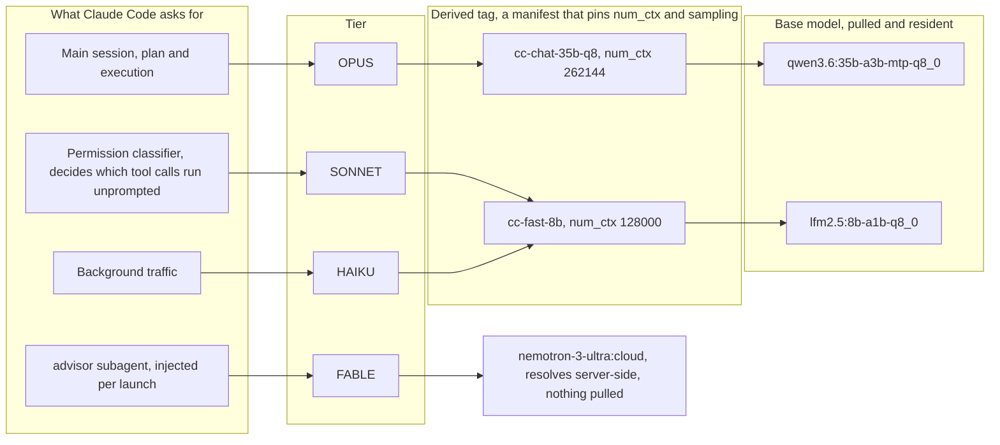

# oclaude, Claude Code on local Ollama models

Run Claude Code against models that Ollama serves.

Requirements:

- **Ollama 0.32 or later**, which serves the Anthropic Messages API natively.
- **PowerShell**. Windows PowerShell 5.1 or PowerShell 7 on Windows, PowerShell 7
  on Linux and macOS.
- The **`claude` CLI** on `PATH`. oclaude configures the environment and then calls it.

## Quick start

```powershell
# 1. Install, which wires oclaude into your PowerShell profile
pwsh -ExecutionPolicy Bypass -File ./install.ps1

# 2. Open a new PowerShell session, then write a config for this machine
oclaude-init-config      # creates ~/.config/oclaude/config.ps1, then edit the map in it

# 3. Pull the models that map names
oclaude-pull

# 4. Run Claude Code
oclaude
```

Step 2 is what makes the launcher yours. Skip it and oclaude runs the defaults in
`lib/config.ps1`, which are one particular machine's models.

Run the installer with the same PowerShell you use day to day. Windows
PowerShell 5.1 (`powershell.exe`) and PowerShell 7 (`pwsh.exe`) keep separate
profiles, so an install from one leaves the other without `oclaude`. The
installer prints the profile it wrote to.

The installer copies nothing. Your profile points at `oclaude.ps1` where it sits
in this repo, so `git pull` updates the launcher with no reinstall.

## How it works

Ollama 0.32 exposes `/v1/messages`, the same endpoint Claude Code uses against
the Anthropic API. oclaude points `ANTHROPIC_BASE_URL` at `http://localhost:11434`,
sets `ANTHROPIC_AUTH_TOKEN=ollama`, and sets more than 20 `CLAUDE_CODE_*`
variables that make the CLI behave against a local model.

oclaude sets those variables inside the launching function and restores them
afterwards, so the shell you started from is unchanged. It exports nothing to
your profile, and a normal `claude` in the same shell still reaches the
Anthropic API.

## The tier system

Claude Code asks for a model by tier. oclaude answers each tier with a different
Ollama model, so every role runs on something suited to it.



The models above are the defaults, chosen for one particular machine. Treat them
as a worked example, not a recommendation: swap in whatever your hardware runs.

Three things in that chain are easy to get wrong.

`SONNET` is not a smaller chat tier. Claude Code asks it to classify whether a
tool call may run without a prompt, so the model sitting there decides how much
the session interrupts you.

`SONNET` and `HAIKU` share one tag here. Nothing requires that, but the
classifier and the background traffic both want the same thing, which is to be
fast and to stay off the main model's runner.

`FABLE` skips the derived-tag layer, because a cloud tag has no local model to
pin. It is also where the advisor subagent runs, so advice comes from a model
other than the one that asked for it.

### Why the derived tag is in the middle

A derived tag references the base model's existing blobs, so it costs a manifest
rather than a copy of the weights.

The pin is the point. Without a per-tag `num_ctx`, every model loads at the
daemon-wide `OLLAMA_CONTEXT_LENGTH`, and at a value large enough for the biggest
model only that one fits in memory. Pinning per tag is what lets the session
model, the classifier and anything else stay resident together.

Run `oclaude-pull` to pull the base models, which rebuilds the derived tags
afterwards. Run `oclaude-build-models` alone after editing only the pins.

## Commands

| Command | Description |
|---------|-------------|
| `oclaude [args]` | Launch Claude Code, defaulting to `--model opus`. Arguments pass straight through, so `-p`, `-c` and `--model` all work |
| `oclaude-status` | Daemon state, the config file in use, per-tier model state, a live cloud access check, and the loaded models |
| `oclaude-init-config` | Create `~/.config/oclaude/config.ps1` from `config.example.ps1`. Refuses to overwrite an existing one |
| `oclaude-config-path` | The config file this shell reads, and whether it exists |
| `oclaude-pull` | Pull the base models, then rebuild the derived tags |
| `oclaude-build-models` | Recreate the derived tags, which pin `num_ctx` and the sampling parameters |
| `oclaude-help` | The same summary, in the shell. Run `claude --help` for the CLI's own flags |

oclaude passes an unrecognised argument to `claude` untouched. `oclaude --help`
is the one exception, and prints oclaude's help rather than the CLI's.

## Config

Config is two files. The repo holds the defaults and the reasoning. Your machine
holds its own map, outside the repo, and overrides any of it.

| File | Role |
|------|------|
| [`lib/config.ps1`](lib/config.ps1) | Committed defaults: one worked map, and the constraint on each tunable |
| `~/.config/oclaude/config.ps1` | Your machine. Outside the repo, so it survives an update and never lands in a commit |
| [`config.example.ps1`](config.example.ps1) | The template `oclaude-init-config` copies. A second worked map: a laptop, cloud chat tiers, one small local tier |

Set `$env:OCLAUDE_CONFIG` to read a different file, which is how to try a map
without moving files. `oclaude-config-path` prints what this shell reads.

Both files hold the same four parts.

1. **`Models`** maps a tier to the tag it runs.
2. **`Derived`** defines each derived tag: its `From` base model, its `NumCtx`
   pin, and its sampling `Params`. Change the model a tier runs by editing the
   `From` value, then run `oclaude-pull`.
3. **`Names`** holds the labels Claude Code shows in its model picker.
4. **The rest** is the endpoint, the advisor, and the Claude Code tunables.

### How the two combine

One rule: **a key in the machine file replaces the matching key outright.**
Nothing merges inside a key.

So a machine file that sets `Models` must list all four tiers, and one that sets
`Derived` must list every spec it needs. A key it leaves out keeps the default,
comments and all.

oclaude warns about the mistakes that rule makes possible: a tier left out of
`Models`, a tier with no label in `Names`, and a key it does not recognise. All
three are silent failures otherwise.

One further check is not about the rule, so it runs for either file.
`AutoCompactWindow` must stay at or below 200000 while `Disable1MContext` is on.
That flag asserts the ceiling, and a larger value trips the CLI's
`window_above_boundary` path.

`Derived` is a library of specs, not a list of things to build. `oclaude-pull`
and `oclaude-build-models` only touch a tag some tier points at, so a spec left
in place for a model you are not running today costs nothing.

oclaude reads the machine file fresh on every command, so an edit takes effect
on the next run with no reload. A file under `lib/` needs a reload, and oclaude
warns when a shell runs code older than the disk. Run `oclaude-build-models`
after editing `Derived` either way.

### Daemon settings are in neither file

The daemon reads its settings from whatever launched it, and that is not always
oclaude. A setting oclaude held would therefore work sometimes, which is worse
than not holding it. So both config files hold none, and the settings go where
the daemon's real starter reads them. `OLLAMA_KEEP_ALIVE`,
`OLLAMA_MAX_LOADED_MODELS`, `OLLAMA_CONTEXT_LENGTH` and `OLLAMA_KV_CACHE_TYPE`
are the ones worth setting.

On **Windows**, those are the User-scope environment variables. The tray
application, a login shell and oclaude all read them.

```powershell
[Environment]::SetEnvironmentVariable('OLLAMA_KEEP_ALIVE', '4h', 'User')
```

The daemon reads that block once, when it starts, so restart it before the change
takes. Quit the tray application and start it again, or sign out and back in.

On **Linux and macOS**, a service manager usually owns the daemon, and a systemd
unit reads a drop-in file rather than your environment. That drop-in is the
platform's User scope.

```ini
# /etc/systemd/system/ollama.service.d/override.conf
# (or ~/.config/systemd/user/ollama.service.d/override.conf for a user unit)
[Service]
Environment="OLLAMA_KEEP_ALIVE=4h"
```

```sh
sudo systemctl daemon-reload
sudo systemctl restart ollama
```

With no unit at all, the daemon inherits the shell that starts it, so exporting
`OLLAMA_*` in your profile is enough.

`oclaude-help` prints the right place for the machine it runs on, so you do not
have to work out which of these cases you are in.

`OLLAMA_CONTEXT_LENGTH` is why the per-tag `num_ctx` pins exist: it is one
window for every model, so sizing it for the largest leaves room for only that
one.

### Context, which is three keys moving together

Claude Code holds **one** context cap and applies it to every tier, so set the
three context keys as a group.

`MaxContextTokens` is that cap. The honest value is the smallest window among
the tiers, because anything larger lets the CLI hand a tier more than it holds
and Ollama then truncates with no error.

`AutoCompactWindow` is where Claude Code compacts. Keep it below the cap so
compaction has room to run, and below the main tier's `num_ctx` so the runner
never context-shifts and drops the oldest tokens.

`Disable1MContext` drops the account's `[1m]` marker. **While it is on, 200000
is a hard ceiling on `AutoCompactWindow`**: a larger value trips the CLI's
`window_above_boundary` path. That is the only reason the default is 200000, not
a property of the models. Turn it off and the ceiling becomes whatever the tiers
hold, which is what a cloud map wants.

So raising the window means all three: `Disable1MContext = $false`, then
`MaxContextTokens` and `AutoCompactWindow` up to the smallest tier. Leave the
flag on and the other two are pinned however large the models are.

A tier can sit below the cap deliberately. `oclaude-build-models` warns when the
**main loop** tier's pin is below the cap, because overfilling that tier loses
the conversation. It prints a quieter note for any other tier below the
auto-compact window, because those tiers read slices and degrade rather than
break. `config.example.ps1` does exactly this: a 262144 cap, the smallest cloud
window, with the local background tier at 128000 and named in a note.

### The other tunables

`StreamIdleMs` covers a queued request, which emits no bytes while it waits.
The built-in idle timeout is three minutes, which a slow local prefill exceeds.

`ToolConcurrency` is 2 in the defaults because Ollama serves one request per
**local** model at a time. A cloud tag has no such limit, so a cloud-heavy map
can raise it.

`lib/config.ps1` records the constraint on each tunable, not the reason its
default is that number. The defaults are one machine's, and models change often
enough that a justification would be stale before you read it.

## The advisor subagent

Each launch injects an `advisor` subagent through the `--agents` flag, so it
exists only inside an oclaude session. oclaude writes nothing to
`~/.claude/agents` or to a repository.

It runs on the `FABLE` tier, which is the cloud model, so advice comes from a
model other than the one that asked. Override the tier for one shell with
`$env:OCLAUDE_ADVISOR`.

Never use a raw Ollama tag. Use an alias: `fable`, `opus`, `sonnet` or `haiku`.
An unresolvable subagent model falls back to the caller's own model with no
error, which makes the advisor the very model that asked for advice.

Pass your own `--agents` to replace the injected set.

## Troubleshooting

### The machine config looks ignored

Run `oclaude-config-path`. It prints the file this shell reads and whether it is
there, which settles the two usual causes: `$env:OCLAUDE_CONFIG` set in one shell
and not another, and a file written to the wrong path.

A file that oclaude reads but that changes nothing has one of two causes, and
oclaude warns about both. Either it sets a key that is not a config key, which
is a typo. Or it ends with something other than a hashtable. A stray expression
above the hashtable writes to the pipeline too, and then two values come back
where one was expected.

### Wrong daemon answered on the port

If `oclaude-status` reports missing local tags, another Ollama holds the port. A
health check proves only that something answers, not that it is your daemon. The
local tags are the decisive test, because a daemon with a different model store
cannot fake them. On Windows the second daemon is usually one from another user
profile. On Linux it is usually a hand-started `ollama serve`, which runs as you
and reads your own empty store while the service runs as the `ollama` user.

```powershell
# Windows
netstat -ano | Select-String ":11434.*LISTENING"
Get-CimInstance Win32_Process -Filter "Name like 'ollama%'" | Select-Object ProcessId, ExecutablePath
taskkill /F /PID <pid>    # from an elevated shell
```

```sh
# Linux and macOS
ss -lptn 'sport = :11434'
ps -o pid,user,args -C ollama
kill <pid>                # sudo if it belongs to another user
```

Then restart the daemon. An all-cloud map has no local tag to check, and oclaude
says so rather than reporting a pass it did not make.

### Model not pulled

oclaude warns at launch when a tier's model is absent. Pull it:

```powershell
oclaude-pull
```

### Stale shell

A shell keeps the functions it loaded at startup, so editing an oclaude file
leaves that shell running the old code. oclaude detects this and warns:

```
stale: this shell loaded oclaude at 14:30, but config.ps1 changed at 14:35.
       run  . $PROFILE  (or open a new tab) to pick the change up.
```

### Cloud model access denied

A cloud tier resolves server-side, so Ollama never pulls it. A 403 means the
model needs a subscription or plan access. `oclaude-status` reports the real
error, because it sends a one-token request rather than guessing. Remove the
model from the map or put a local one in its place.

### Restarting the daemon

oclaude starts the daemon when it is down, but never restarts a running one. That
is one command you already have, and it differs by who owns the daemon:
`sudo systemctl restart ollama` under systemd, or quitting and reopening the tray
application on Windows.

Killing the daemon by hand on Windows leaves its `llama-server` children running,
still holding tens of GiB. Stop those too.

The tray application also forces its own `OLLAMA_CONTEXT_LENGTH` when it starts
the daemon. The per-tag `num_ctx` pins are what work around that.

## Platform

Windows, Linux and macOS. PowerShell 7 runs on all three, and Windows PowerShell
5.1 works on Windows.

The daemon handling is the only part that differs, and all of it is in
[`lib/daemon.ps1`](lib/daemon.ps1). On Windows it manages the process and reads
User-scope variables. On Unix it drives the systemd unit where there is one,
because starting `ollama serve` by hand beside a service gives a second daemon
with a different model store.
