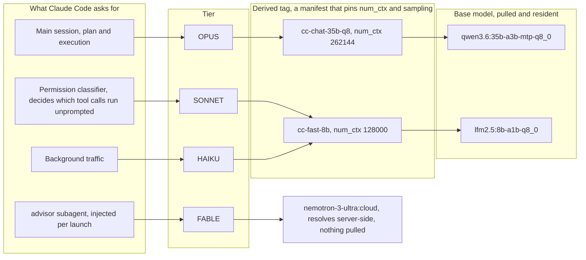

# oclaude, Claude Code on local Ollama models

Run Claude Code against models served locally by Ollama.

Requirements:

- **Ollama 0.32 or later**, which serves the Anthropic Messages API natively.
- **PowerShell** on Windows.
- The **`claude` CLI** on `PATH`. oclaude configures the environment and then calls it.

## Quick start

```powershell
# 1. Install, which wires oclaude into your PowerShell profile
pwsh -ExecutionPolicy Bypass -File .\install.ps1

# 2. Open a new PowerShell session, then pull the models
oclaude-pull

# 3. Run Claude Code
oclaude
```

Run the installer with the same PowerShell you use day to day. Windows
PowerShell 5.1 (`powershell.exe`) and PowerShell 7 (`pwsh.exe`) keep separate
profiles, so an install from one leaves the other without `oclaude`. The
installer prints the profile it wrote to.

The installer copies nothing. Your profile points at `oclaude.ps1` where it sits
in this repo, so `git pull` updates the launcher with no reinstall.

## How it works

Ollama 0.32 exposes `/v1/messages`, the same endpoint Claude Code uses against
the Anthropic API. oclaude points `ANTHROPIC_BASE_URL` at `http://localhost:11434`,
sets `ANTHROPIC_AUTH_TOKEN=ollama`, and sets more than 20 `CLAUDE_CODE_*`
variables that make the CLI behave against a local model.

oclaude sets those variables inside the launching function and restores them
afterwards, so the shell you started from is unchanged. Nothing is exported to
your profile, and a normal `claude` in the same shell still reaches the
Anthropic API.

## The tier system

Claude Code asks for a model by tier. oclaude answers each tier with a different
Ollama model, so every role runs on something suited to it.



The models above are the defaults, chosen for one particular machine. Treat them
as a worked example, not a recommendation: swap in whatever your hardware runs.

Three things in that chain are easy to get wrong.

`SONNET` is not a smaller chat tier. Claude Code asks it to classify whether a
tool call may run without a prompt, so the model sitting there decides how much
the session interrupts you.

`SONNET` and `HAIKU` share one tag here. Nothing requires that, but the
classifier and the background traffic both want the same thing, which is to be
fast and to stay off the main model's runner.

`FABLE` skips the derived-tag layer, because a cloud tag has no local model to
pin. It is also where the advisor subagent runs, so advice comes from a model
other than the one that asked for it.

### Why the derived tag is in the middle

A derived tag references the base model's existing blobs, so it costs a manifest
rather than a copy of the weights.

The pin is the point. Without a per-tag `num_ctx`, every model loads at the
daemon-wide `OLLAMA_CONTEXT_LENGTH`, and at a value large enough for the biggest
model only that one fits in memory. Pinning per tag is what lets the session
model, the classifier and anything else stay resident together.

Run `oclaude-pull` to pull the base models, which rebuilds the derived tags
afterwards. Run `oclaude-build-models` alone after editing only the pins.

## Commands

| Command | Description |
|---------|-------------|
| `oclaude [args]` | Launch Claude Code, defaulting to `--model opus`. Arguments pass straight through, so `-p`, `-c` and `--model` all work |
| `oclaude-status` | Daemon state, per-tier model state, a live cloud access check, and the loaded models |
| `oclaude-pull` | Pull the base models, then rebuild the derived tags |
| `oclaude-build-models` | Recreate the derived tags, which pin `num_ctx` and the sampling parameters |
| `oclaude-restart-daemon` | Restart Ollama with the User-scope `OLLAMA_*` variables applied |
| `oclaude-help` | The same summary, in the shell. Run `claude --help` for the CLI's own flags |

An unrecognised argument is passed to `claude` untouched, so `oclaude --help`
is the one exception: it prints oclaude's help rather than the CLI's.

## Config

Everything tunable lives in [`lib/config.ps1`](lib/config.ps1), in four parts.

1. **`$models`** maps a tier to the tag it runs. Point a tier at a different
   derived tag here.
2. **`$derived`** defines each derived tag: its `From` base model, its `NumCtx`
   pin, and its sampling `Params`. Change the model a tier runs by editing the
   `From` value, then run `oclaude-pull`.
3. **`$names`** holds the labels Claude Code shows in its model picker.
4. **The returned object** holds the rest: the endpoint, the advisor, and the
   Claude Code tunables.

Run `oclaude-build-models` after editing `$derived`. An open shell keeps the
functions it loaded at startup, so oclaude warns when a file has changed on
disk since the shell loaded it.

### Daemon settings are not in config.ps1

They live in the User-scope `OLLAMA_*` environment variables, because the daemon
reads its settings from whatever launched it, and that is not always oclaude. If
the Ollama tray application is installed it starts the daemon first and ignores
anything oclaude would have passed. User scope is the one place every starter
reads, so it is the only place a setting reliably takes.

Set them once, then run `oclaude-restart-daemon`, which re-reads User scope and
prints what it applied. `OLLAMA_KEEP_ALIVE`, `OLLAMA_MAX_LOADED_MODELS`,
`OLLAMA_CONTEXT_LENGTH` and `OLLAMA_KV_CACHE_TYPE` are the ones worth setting.

```powershell
[Environment]::SetEnvironmentVariable('OLLAMA_KEEP_ALIVE', '4h', 'User')
oclaude-restart-daemon
```

`OLLAMA_CONTEXT_LENGTH` is why the per-tag `num_ctx` pins exist: it is one
window for every model, so sizing it for the largest leaves room for only that
one.

### The tunables that matter most

`MaxContextTokens` must stay at or below the smallest `num_ctx` among the
tiers. Claude Code holds one global value, so a larger number lets it overfill
the smallest tier, and Ollama then truncates with no error.

`AutoCompactWindow` is where Claude Code compacts. Keep it below `num_ctx` so
the runner never context-shifts and drops the oldest tokens silently.

`StreamIdleMs` covers a queued request, which emits no bytes while it waits.
The built-in idle timeout is three minutes, which a slow local prefill exceeds.

`ToolConcurrency` is 2 because Ollama serves one request per model at a time.
A higher value only queues the calls and risks the idle timeout.

`lib/config.ps1` carries the reasoning for each value as comments. Read them
before changing one.

## The advisor subagent

Each launch injects an `advisor` subagent through the `--agents` flag, so it
exists only inside an oclaude session. Nothing is written to `~/.claude/agents`
or to a repository.

It runs on the `FABLE` tier, which is the cloud model, so advice comes from a
model other than the one that asked. Override the tier for one shell with
`$env:OCLAUDE_ADVISOR`. Use an alias (`fable`, `opus`, `sonnet` or `haiku`),
never a raw Ollama tag: an unresolvable subagent model falls back to the
caller's own model without an error, which makes the advisor the very model
that asked for advice.

Pass your own `--agents` to replace the injected set.

## Troubleshooting

### Wrong daemon answered on port 11434

If `oclaude-status` reports missing derived tags, a stale Ollama from another
user profile may hold the port. A health check proves only that something
answers on 11434, not that it is your daemon. The derived tags are the decisive
test, because a daemon with a different model store cannot fake them.

```powershell
netstat -ano | Select-String ":11434.*LISTENING"
Get-CimInstance Win32_Process -Filter "Name like 'ollama%'" | Select-Object ProcessId, ExecutablePath
taskkill /F /PID <pid>    # from an elevated shell
oclaude-restart-daemon
```

### Model not pulled

oclaude warns at launch when a tier's model is absent. Pull it:

```powershell
oclaude-pull
```

### Stale shell

A shell keeps the functions it loaded at startup, so editing an oclaude file
leaves that shell running the old code. oclaude detects this and warns:

```
stale: this shell loaded oclaude at 14:30, but config.ps1 changed at 14:35.
       run  . $PROFILE  (or open a new tab) to pick the change up.
```

### Cloud model access denied

A cloud tier resolves server-side, so Ollama never pulls it. A 403 means the
model needs a subscription or plan access. `oclaude-status` reports the real
error, because it sends a one-token request rather than guessing. Remove the
model from the map or put a local one in its place.

### The daemon will not start

`oclaude-restart-daemon` stops the daemon and its `llama-server` children, then
starts it again with the User-scope `OLLAMA_*` variables applied. The children
matter: stopping only the parent orphans them, and they keep holding memory.

```powershell
oclaude-restart-daemon
```

The daemon reads its settings from whatever launched it. A shell opened before
you changed a User-scope `OLLAMA_*` variable still carries the old value, which
is what this command exists to fix. When the Ollama tray application is
installed, it starts the daemon and forces its own `OLLAMA_CONTEXT_LENGTH`.
The per-tag `num_ctx` pins are what work around that.

## Platform

Windows and PowerShell only. Ollama is cross-platform, but this wrapper manages
the daemon with PowerShell cmdlets such as `Invoke-RestMethod`, `Start-Process`
and `Get-Process`.
